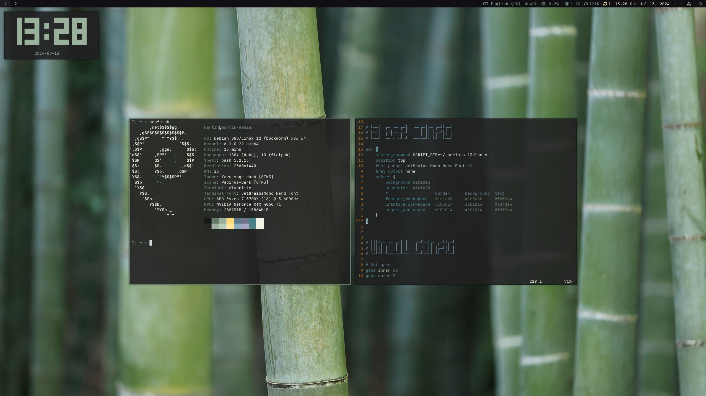
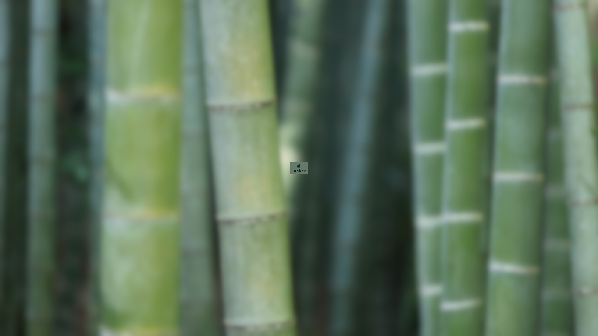

# i3wm dotfiles
These are my dotfiles for i3wm, on my Debian system. The installation guide is located below.
## Screenshots
### Workspace

### Lock screen

## Installation
**[!] The `install.sh` file is only meant for my personal use - do not run it on your system. It installs programs and drivers that only I use, and also configures programs like Grub and LightDM with my config files, which might break your system or compromise security. DO NOT RUN THE `INSTALL.SH` SCRIPT!**
To install this theme, paste the provided configs to their respective locations on your system. The `.scripts` folder is the only exception to this, as it is meant to be in your home directory. You will also need to install the following dependencies: i3, i3blocks, i3lock, rofi, dunst, picom, alacritty, curl, kbdd, Yaru sage dark GTK theme (and all of it's dependencies), Papirus palebrown dark icon theme
